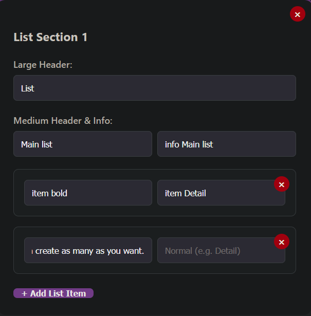
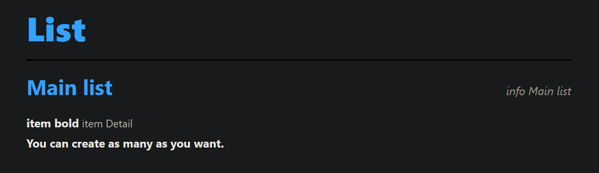
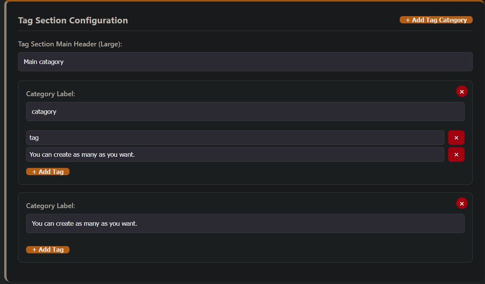
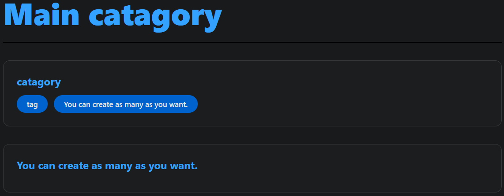
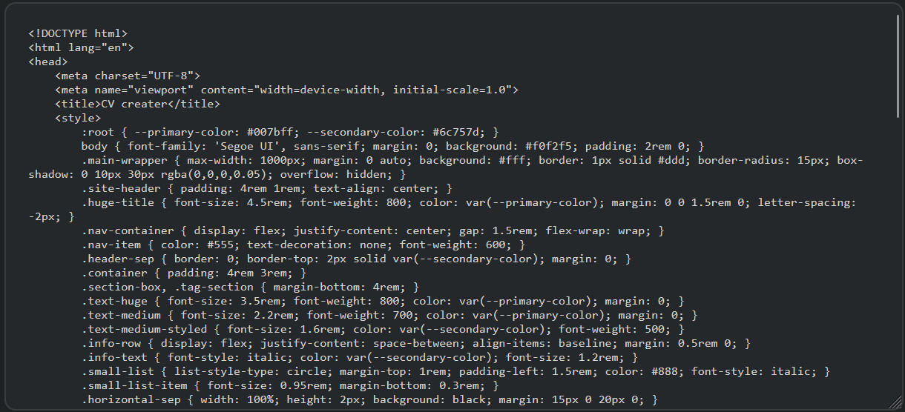

# All Rights Reserved.

# Copyright (c) 2026 Abdullah Hamad Almousa
---
### How it look like for each section

### Header

### The result

### Main Section

### The result

### List Section

### The result

### Catagory Section

### The result

### Take the output

Take the output and create the text file

place the output in text file

change the format of the file from txt to html

then open your website on browser recommended (Firefox)

click ctrl + P

make sure Destination is Microsoft print to pdf and paper size is letter
